# 聯邦學習：梯度洩漏攻擊與防禦

NTUST 114-2 資訊安全期末專題。從頭手刻 Federated Learning，示範梯度反演攻擊（DLG / iDLG），再用差分隱私與同態加密兩種防禦把攻擊擋回去。

Threat model：**honest-but-curious server**——伺服器忠實執行 FedAvg 聚合，但會試圖從 client 上傳的梯度還原其私有訓練影像。

## 總覽

「不上傳資料」不等於「不洩漏資料」。聯邦學習讓每個 client 只交出梯度、把原始人臉留在本地，看似就保護了隱私；但**單一梯度就足以反推出原始人臉**。本專案分四步把攻擊做出來、再擋回去：

- **Step 1 — 聯邦學習**：手刻 FedAvg，4 個 client、IID 切分，在 ORL 人臉上訓練一個 LeNet（DLG 論文版：Sigmoid + strided conv，約 38K 參數），收斂到 ~0.89 測試準確率，與 centralized baseline 相當。
- **Step 2 — 梯度反演攻擊**：以 **DLG / iDLG**（LBFGS 匹配梯度）從單一梯度還原人臉。用三條軸觀察攻擊何時失效——**batch size**（`1 → 8`）、**訓練進度**（`round 1 → 50`，跨 3 seed 平均），以及**攻擊真正上傳的 weight delta**（1 步 SGD 的 delta 完美還原、多步 Adam 的 delta 失效，補上 threat-model 缺口）。
- **Step 3 — 差分隱私（兩種互補機制）**：
  - **Update-level DP-FedAvg**：裁剪整個 weight delta + 加高斯噪音，plain-RDP 計 ε。無子取樣放大 → ε 永遠是天文數字、且準確率一加噪就崩。發現：經驗隱私便宜（`z≈0.002` 即擋住 DLG、準確率仍 0.90），形式隱私昂貴到不可用。
  - **Record-level DP-SGD（Abadi 機制）**：**逐樣本**梯度裁剪 + 高斯噪音 + **子取樣高斯 RDP**。準確率**優雅下降**（`ε≈2800→300` 時 acc `0.94→0.76`），證明 DP「機制」選擇有差；但要 ε<10 仍得犧牲大半準確率（38K 參數、320 張影像的維度詛咒），與 HE 形成對比。
- **Step 3-1 — 同態加密（Bonus）**：client 用 **TenSEAL CKKS** 加密 update，server 只在密文上做加法與 `× 1/N`，全程拿不到明文梯度，DLG 連目標函數都湊不出來。

四組實驗共用 `seed = 0` 的 train/test 切分與 client 分割，明文、DP、HE 的結果才能彼此對照。

---

## 示例圖

**Step 1 — 聯邦學習收斂**

準確率與損失皆為 **3 個 seed 的 mean ± std**（單 seed 兩條線會被 test-set 雜訊蓋過、甚至讓 FedAvg 看似超過 centralized）：

| 準確率（FedAvg vs Centralized） | 損失 |
|:---:|:---:|
| 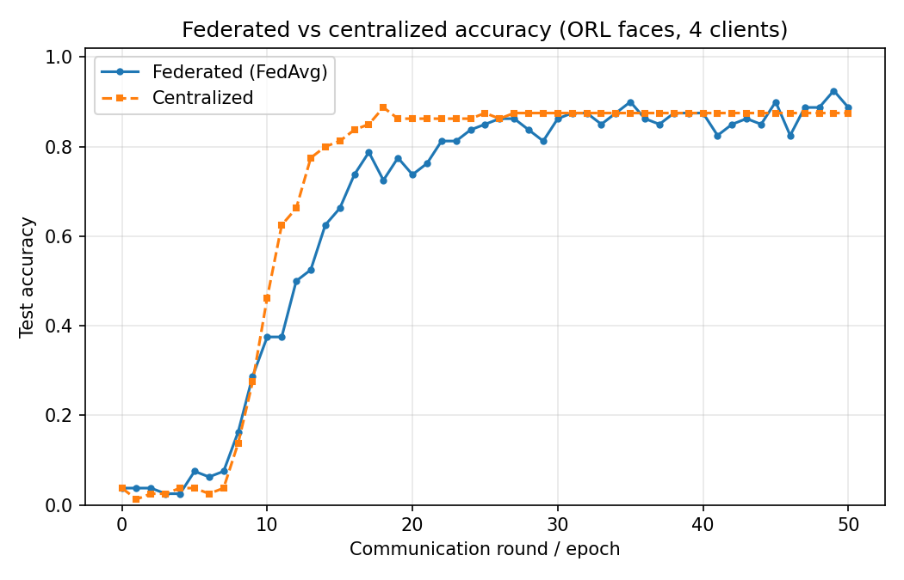 | 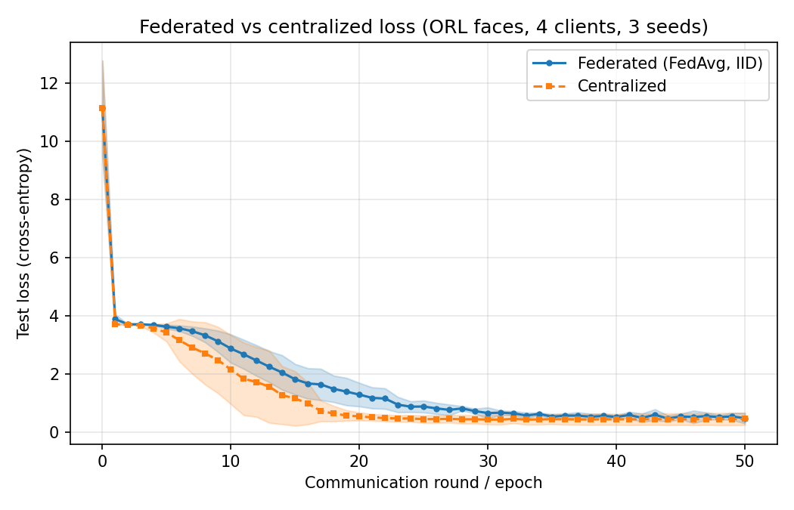 |

**client drift（non-IID）**：10 個 client、每輪只抽 50% 參與，比較 IID 與 **Dirichlet(α)** label skew 的逐輪收斂曲線。α 越小越非 IID——IID 收斂到 0.91、α=1.0（溫和）0.90、**α=0.1（嚴重）只到 0.80 且變異約 3 倍**（收斂明顯變慢、震盪）。這是 FL 最經典的 drift 效應；需要多 client + 部分參與才看得出來（舊版 4 client 全參與時差距被雜訊蓋過）。

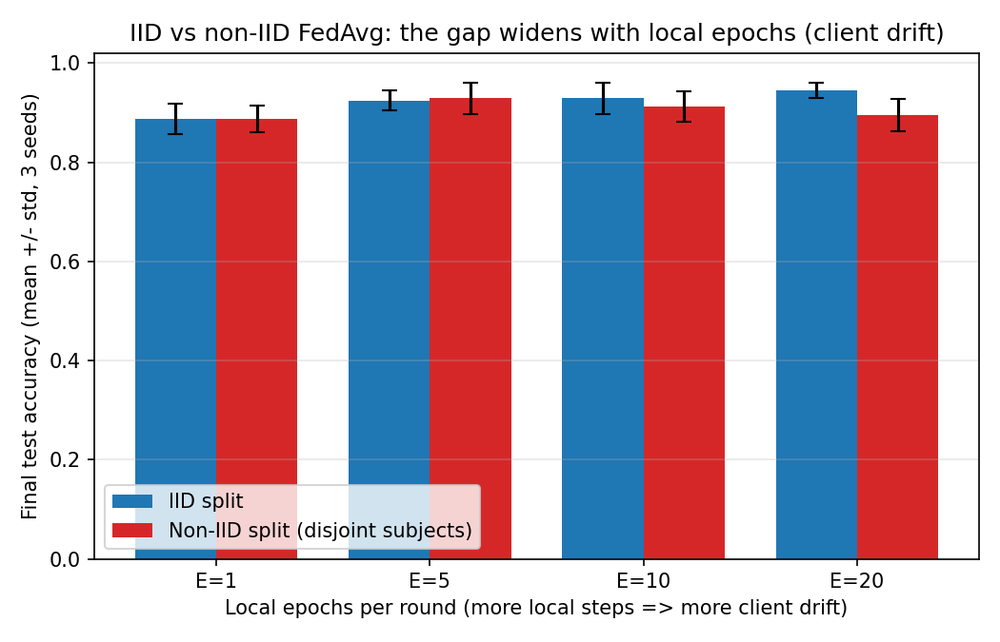

**Step 2 — 梯度反演攻擊**

從隨機雜訊開始，LBFGS 逐步把 dummy 影像逼近成原始人臉（iter 10 已認得出人、iter 30 後幾乎完美）：

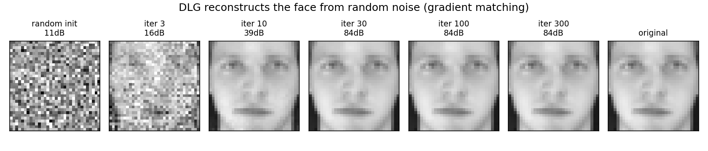

| 未訓練模型：8 人各一張（皆完美還原，故上下兩列幾乎一模一樣） | 還原品質隨 batch size 崩潰 |
|:---:|:---:|
| 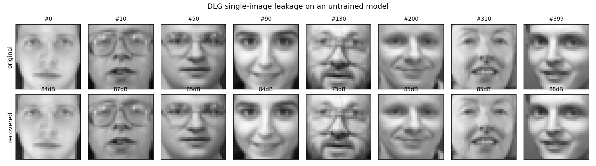 | 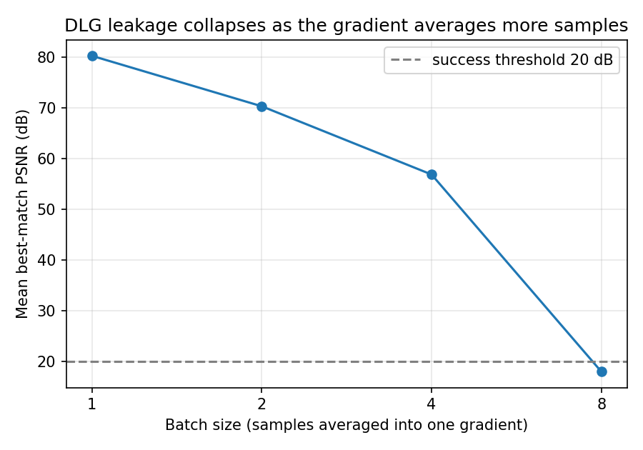 |

| 攻擊成功率隨訓練進度崩潰（8 受害者 × 3 seed = 24 次/輪，PSNR > 20 dB 的比例） | iDLG vs DLG 的收斂速度 |
|:---:|:---:|
| 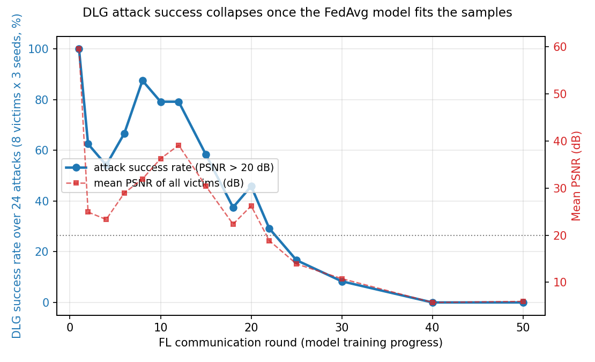 | 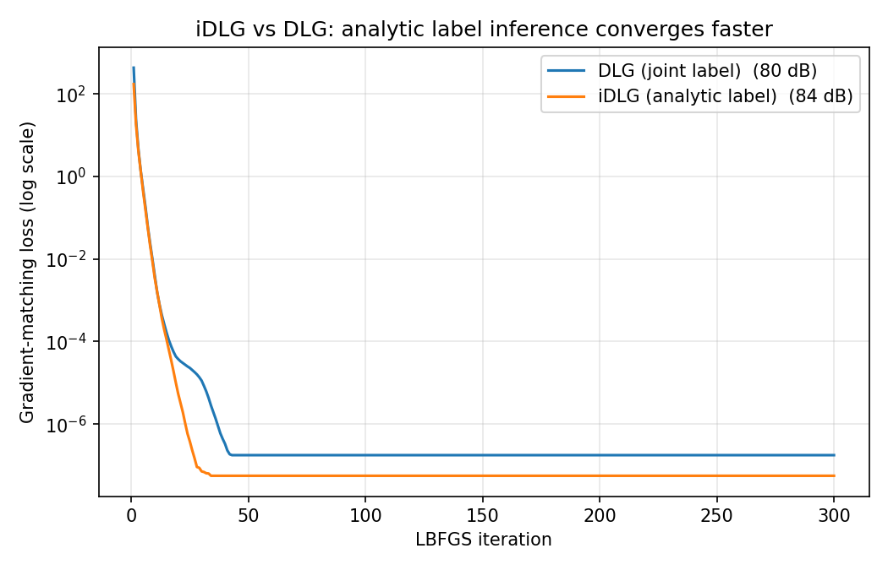 |

攻擊**真正上傳的 weight delta**（補 threat-model 缺口）：1 樣本 + 1 步 SGD 時 `delta = -lr·g`，反演近乎完美（**84 dB**，證明真實上傳就會洩漏）；換成真實 FedAvg 的多步 Adam delta，naive 反演失效（**6 dB**）：

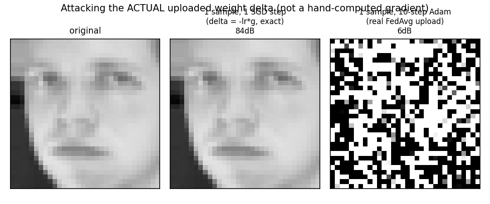

**Step 3 — 差分隱私**

_Update-level DP-FedAvg_（裁剪整個 delta；ε 永遠無意義）：

| 隱私–效用權衡（準確率、DLG PSNR vs 噪音 `z` / 預算 `ε`） | 不同 `z`（對應 `ε`）下的還原 |
|:---:|:---:|
| 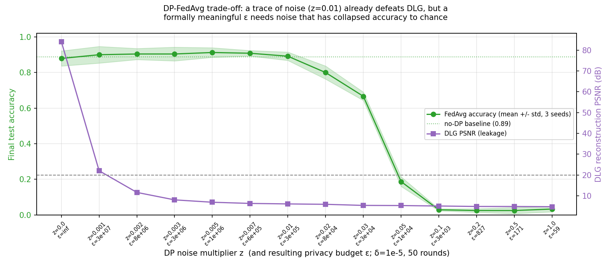 | 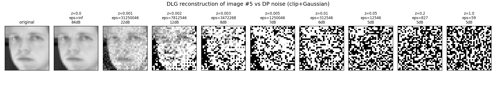 |

_Record-level DP-SGD_（逐樣本裁剪 + 子取樣 RDP；準確率**優雅下降**，是 Step 3 真正的 accuracy–ε 取捨前緣）：

| 準確率優雅下降 vs ε（DLG 已被裁剪本身擋住、與 z 無關） | 不同 `z`（對應 `ε`）下的還原 |
|:---:|:---:|
| 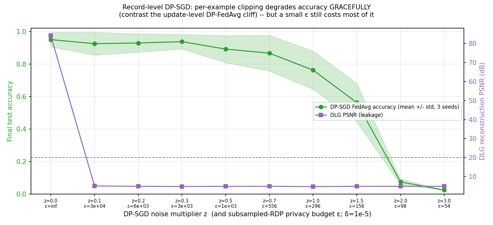 | 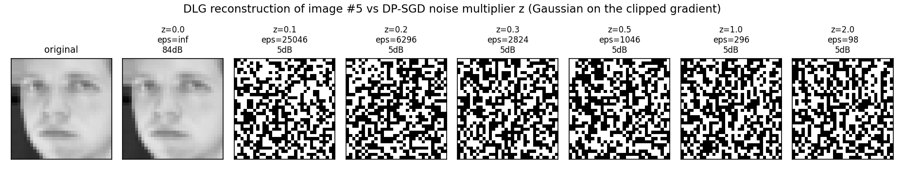 |

**Step 3-1 — 同態加密**

| HE 防禦：server 只看得到密文 | 加密 vs 明文準確率 |
|:---:|:---:|
| 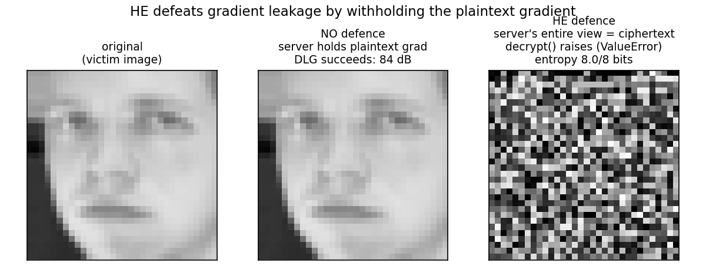 | 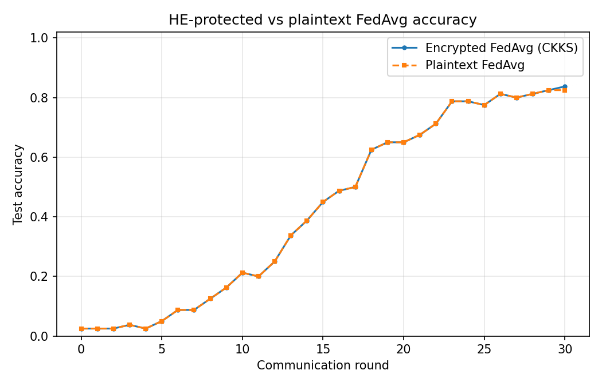 |

每輪 CKKS 各階段耗時（encrypt / aggregate / decrypt）：

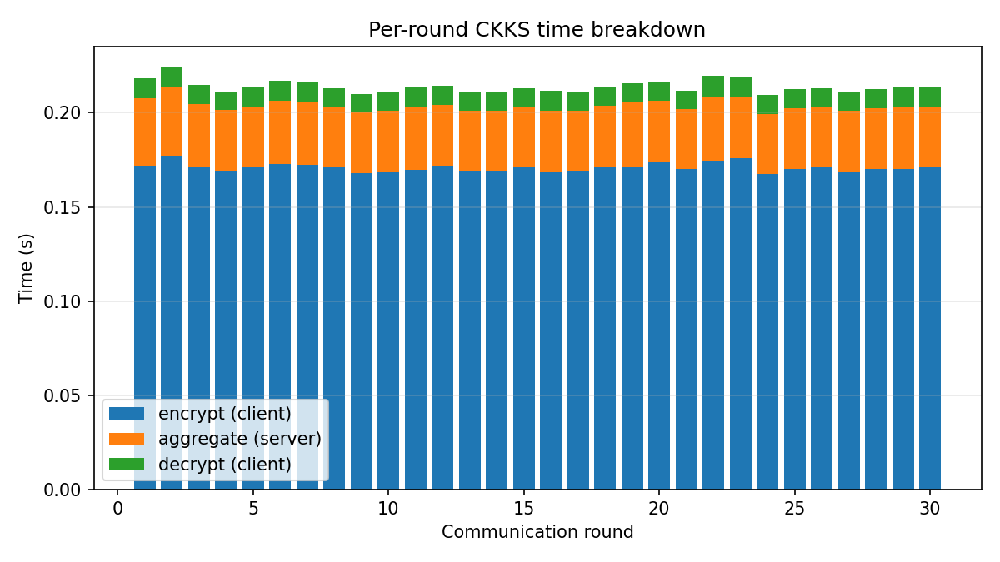

> ORL / AT&T / Olivetti 是同一份人臉資料庫（40 人 × 10 張，64×64 灰階），首次執行時自動從 GitHub PNG 鏡像下載，整理成 `data/orl_faces/s1..s40`；載入時 resize 到 32×32 並做 z-score 正規化。

---

## 環境與執行

```bash
uv sync                                    # Python 3.12 + torch / tenseal / scikit-image ...

uv run python experiments/run_fl.py        # Step 1：FedAvg + centralized baseline + non-IID drift
uv run python experiments/run_attack.py    # Step 2：DLG / iDLG 攻擊（需先跑 run_fl）
uv run python experiments/run_dp.py        # Step 3：update-level DP-FedAvg（accuracy / DLG vs ε）
uv run python experiments/run_dp_sgd.py    # Step 3：record-level DP-SGD（子取樣 RDP，優雅取捨）
uv run python experiments/run_defense.py   # Step 3-1：CKKS 同態加密防禦
uv run pytest                              # FedAvg / metrics / DLG / DP / DP-SGD / dirichlet / HE roundtrip
```

圖表輸出於 `results/figures/`、數據於 `results/metrics/`，皆已 commit 與團隊共享；資料集會自動下載、與虛擬環境一併排除在版控外。

## 重點數據

| 階段 | 結果 |
|------|------|
| FL 收斂（3 seed） | FedAvg 0.89±0.03、centralized 0.91±0.03（相當，centralized 為上界）|
| FL non-IID（client drift；10 client、50% 參與） | IID 0.91、Dirichlet α=1.0 0.90、**α=0.1 僅 0.80 且變異 ~3×**（收斂慢且震盪）|
| DLG（未訓練模型） | 8/8 完美還原，平均 ~84 dB；iDLG 84.5 dB 比 plain DLG 80.2 dB 收斂更快更穩 |
| DLG vs batch size | batch `1 → 2 → 4 → 8`：80 → 70 → 57 → 18 dB（單調崩潰）|
| DLG vs 訓練進度（8 受害者 × 3 seed） | 攻擊成功率：round 1 100%、round 2–12 約 54–88%（震盪）、round 15–30 由 58% 緩降到 8%、round 40 起 0%（隱私臨界落在 round ~15–40；跨 seed 平均後比單 seed 的「20–25 急崖」更平緩，也更誠實）|
| DLG vs 真實上傳 delta | 1 樣本 1 步 SGD（`delta=-lr·g`）反演 **84 dB**（真實上傳就會洩漏）；多步 Adam delta naive 反演 **5.6 dB**（失效）|
| DP-FedAvg（update-level，clip C=7） | ε 永遠無意義（≥59）：`z=0.002` 即把 DLG 打到 12 dB、準確率仍 0.90，但對應 ε≈8e6；`z=0.05` 準確率掉到 0.19、`z≥0.1` 隨機。經驗隱私便宜、形式隱私不可用 |
| **DP-SGD（record-level，逐樣本裁剪 + 子取樣 RDP）** | **準確率優雅下降**：ε 2824/1046/296/156 ↔ acc 0.94/0.89/0.76/0.56，ε≈98 才崩到隨機。比 update-level 漂亮得多（同 ε 下準確率高一個檔次），但 ε<10 仍不可得；子取樣（q=0.25）把 ε 壓到 49 卻也把準確率打到隨機（維度詛咒）|
| HE 收斂（50 round） | 加密 0.875 vs 明文 0.8625（差 ≤ 0.025）；CKKS 聚合相對誤差 1.6e-7（故準確率幾乎不受影響）|
| HE 防禦 | server 無 secret key，`decrypt()` 直接拋例外，密文熵 7.97/8 bits/byte |
| HE 成本 | 密文 32.7× 明文；50 輪總 CKKS 時間 11.6s（encrypt 8.8 + aggregate 2.3 + decrypt 0.5）|
